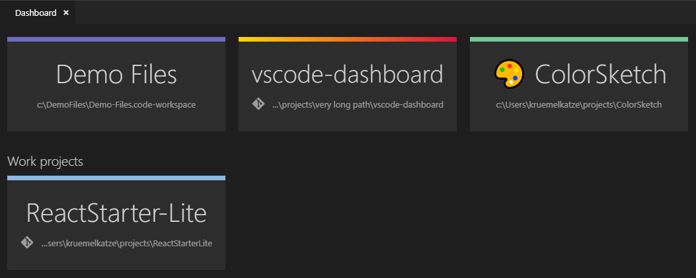

# vscode-dashboard

**vscode-dashboard** is a Visual Studio Code extension that lets you organize your projects/workspaces in a speed-dial like manner. Pin your frequently visited folders and files onto a dashboard to access them quickly.

## Usage
The dashboard is a dedicated webview inside vscode that is opened when the welcome page is shown. It can also be opened via command.

Adding a workspace or file (project) can be done via command or button.  You are then prompted to provide a title, path and an optional color.

Editing the project list currently has to be done manually by editing a JSON file.

### Commands
The commands should speak for themselves. :)
* Dashboard: Open (ctrl + f1)
* Dashboard: Add Project
* Dashboard: Edit Projects
* Dashboard: Remove Projects

## Changelog
[View Changelog](CHANGELOG.md)

## Notes
Only colors defined by the theme were used. So the dashboard should always blend nicely into your VSCode design. 